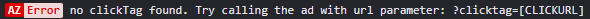
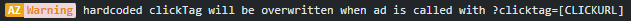
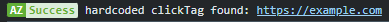
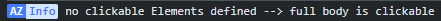

<h1>HTML Ad Boilerplate/Toolkit</h1>

-  index.html
-  style.css
-  azAd.js
-  assets folder

---

<h2>azAd.js - a basic toolkit for digital ads</h2>
azAd.js includes a small selectiom of functions, which either could be usefull for ad creation tasks, or ad operation tasks.

<h3>Clickout handling</h3>
Clickouts in digital ads are often <b>not</b> triggered by HTML a-tags, but instead by a <code>window.open()</code> javascript function.
The link is either hardcoded defined in a variable called <code>clickTag</code> or is parsed into the ad via URL parameter.

By default azAd.js is checking for a URL parameter "clicktag" in the URL (e.g. https://cdnserver.com/myad/?clicktag=https://example.com) and assigns it to the whole html body as clickoutlink.
<br><br>
If you want to specifiy certain elements to be clickable only, you can add their IDs to the array <code>clickableElementIds</code> in the index.html. Then only the sepcified elements are clickable.

<h3><code>getUrlParam(string)</code> </h3>

A function to get URL-query parameter data, like a clicktag

return parameter value = the intended functionality to get URL-paramaeter data<br>
if return <code>false</code> = URL-parameter not found<br>
if return <code>true</code> = URL-parameter keyfound, but no value<br>

<h4>Usage</h4>

```javascript
//ad is called through the URL https://example.com/?importantData=helloWorld

console.log(getUrlParam('importantData'));

//returns helloWorld
```

<h3><code>create(type,settingObj)</code> </h3>
A handy function to create DOM elements on the go, together with attributes and their contents.

<h4>Usage</h4>

```javascript
const myElement =
        create('div',
                {
                id:'footer-logo',
                class: 'logo',
                style: 'border:2px solid red',
                content : '',
                });

console.log(myElement);

/*  returns ...
<div id="footer-logo" class="logo" style="border:2px solid red">
   
</div>
*/

```

<h3><code>azLog(obj)</code> </h3>
A custom console.log function, to highlight own console.logs, which can be useful, when you try to identify you own stuff in a messy live enviroment, where the console is spammed by multiple sources.

<h5>Types</h5>

| Type    | Style                              |
| ------- | ---------------------------------- |
| error   |    |
| warning |  |
| success |  |
| info    |     |

<h4>Usage</h4>

```javascript
azLog({warning,'You didnt sleep 8 hours this night. Try to make a rest.'});
```

---
