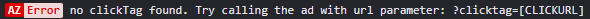
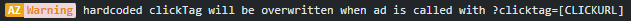
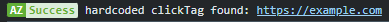
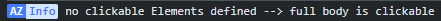

<h1>HTML Ad Boilerplate/Toolkit</h1>

<p style="font-size:20px;">This is my basic package to start building an ad from scratch.<p>

-  [index.html](./dist/index.html)
-  [style.css](./dist/style.css)
-  [azAd.min.js](./dist/azAd.min.js)

<br>

---

<h2>index.html & style.css</h2>

The [index.html](./dist/index.html) includes a basic HTML sceleton, with a suitable viewport, a div to work in <code>`<div id="azAd" class="mpu"></div>`</code> and the minifyed [azAd.js](./dist/azAd.js) at the bottom.<br><br>
The html-tag has a <code>class="preload"</code>. This is added to avoid css keyframe animations beeing visible on pageload (if you know, you know ;-). The class is removed by azAd.js, when all assets are loaded.<br><br>
The [style.css](./dist/style.css) file includes some basic reset styles, some standard ad sizes and an overlay for the class <code>interstitial</code>, which tells the user to rotate the device.
<br><br>
<br>

<h2>azAd.js</h2>
azAd.js includes a small selection of functions, which I use in my daily work when creating ads or managing the ad ops part of a campaign.
<br><br>

---

<h3>Clickout handling</h3>
Clickouts in digital ads are often <b>not</b> triggered by HTML a-tags, but instead by Javascript <code>window.open()</code> function.
The clickout link is either hardcoded stored in a variable called <code>clickTag</code> or is parsed into the ad via URL parameter.
<br><br>
By default azAd.js is checking for a URL parameter "clicktag" in the URL (e.g. https://cdnserver.com/myad/?clicktag=https://example.com) and assigns it to the whole html body as clickoutlink.
<br>
If you want to specifiy certain elements to be clickable only, you can add their IDs to the array <code>clickableElementIds</code> in the index.html. Then only the sepcified elements are clickable.

<br>

<br><br>

---

<h3>Function <code>track(pxlUrl)</code> </h3>

This function is loading a tracking pixel, for engagement tracking. If the cachbuster macro <code>`[timestamp]`</code> is found in pixel url, it will be replaced with a randomized number.

<h4>Usage</h4>

```javascript
var trackingPixel = 'https://trackingserver.com/trackingpixel.jpg?cachebuster=[timestamp]';

track(trackingPixel);

// console shows loaded pixel
// https://trackingserver.com/trackingpixel.jpg?cachebuster=1354649
```

<br><br>

---

<h3>Function <code>getUrlParam(string)</code> </h3>

A function to get URL-query parameter data, like a clicktag

<h4>Usage</h4>

```javascript
//ad is called through the URL https://example.com/?importantData=helloWorld

console.log(getUrlParam('importantData'));
//returns helloWorld

// if return false = URL-parameter not found
// if return true = URL-parameter key found, but no value
```

<br><br>

---

<h3>Function <code>create(type,settingsObj)</code> </h3>
A handy function to create DOM elements on the go, together with attributes and their contents.

<h4>Usage</h4>

```javascript
const myElement = create('div', {
	id: 'logo-footer',
	class: 'logos',
	style: 'border:2px solid red',
	content: ``,
});

console.log(myElement);

/*  returns DOM element
<div id="logo-footer" class="logos" style="border:2px solid red">
    
</div>
*/
```

<br><br>

---

<h3>Function <code>azLog(obj)</code> </h3>
The console in advertisment enviroments is often very poluted from different sources and sometimes its hard to find own logs. This function creates customized console.logs to make own logs more visible.
<br>

<h4>Usage</h4>

```javascript
azLog({ error: 'Lorem ipsum dolor sit amet...' });
azLog({ warning: 'Lorem ipsum dolor sit amet...' });
azLog({ success: 'Lorem ipsum dolor sit amet...' });
azLog({ info: 'Lorem ipsum dolor sit amet...' });
```

| Type    | Console Style (how it looks in your console) |
| ------- | -------------------------------------------- |
| error   |                     |
| warning |                   |
| success |                   |
| info    |                      |

<br><br>

---

<h3>Function <code>generateAzTag()</code></h3>

After uploading the ad to a (CDN)server, this function can generate the ad-tag script, which is used for the campaign.
Just press <code>F10</code> on the keyboard and the script will be displayed.
<br><br>

```html
<!-- 
// when you press F10 this will be displayed as overlay
// the ad operator only has adjust the correct click macro
// and add the size of the ad at width/height (like '300px' or '100%' )
-->

<script>
    var azAd = {
        src: 'https://creative.bluestack.app/direct/724-5/index.html',
        clickout: '[CLICKMACRO]',
        width: '[CREATIVE_WIDTH]',
        height: '[CREATIVE_HEIGHT]',
	};
var azFrame ='<iframe src="'+azAd.src+'?clicktag='+encodeURIComponent(azAd.clickout)+'" style="width:'+azAd.width+';height:'+azAd.height+';border:0px #fff none;" scrolling="no" frameborder="0" allowfullscreen></iframe><style>body,html{width:100%;height:100%;padding:0;margin:0}</style>';document.write(azFrame);
</script>
```
