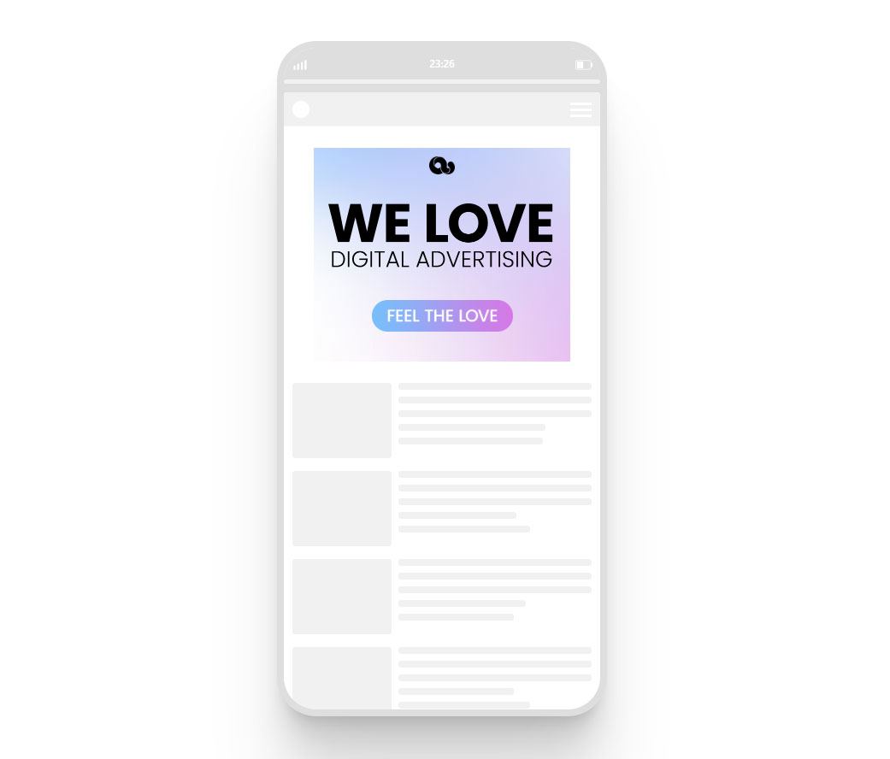

# HTML Ad Boilerplate & azAd.js Toolkit

<p style="font-size:20px;">This is my basic package to start building an ad from scratch. <>

-  [index.html](./azAd_boilerplate/index.html)
-  [style.css](./azAd_boilerplate/style.css)
-  [azAd.js](./azAd_boilerplate/azAd.js)

<br>

The HTML/CSS files are nothing special, just basic templates for me to start, so I don't have to type the sames things every time. But don't reading, you might be interessted in the azAd.js

----

<br>

## 🚀 azAd.js Toolkit
The azAd.js is a handy selection of functions for people who build HTML ads and those who manage the campaigns afterwards. These are functions, which I use in my daily work when creating ads or managing the ad ops part of a campaign.
<br>

<br>

-  [Preview Mode](#Preview-mode)
-  [Clickout handling](#Clickout-handling)
-  [Load Trackingpixel](#Load-Trackingpixel)
-  [URL-Parameter](#URL-Parameter)
-  [Create DOM elements](#Create-DOM-elements)
-  [Custom Logs](#az-Logs)
-  [Generate Ad Tag Script](#Generate-Ad-Tag)

<br><br>
---

### Preview Mode


<br>

- when you add azAd.js to your html ad,you can call the ad with <code>?preview=${format}</code> url parameter and it generates a preview in a smartphone like frame
- available formats: int, mrec/mpu, banner, hpa
- alternativly add specific sizein pixel like <code>?preview=300x600</code>
- this preview feature is loaded externally and only when the parameter is added, so the the azAd.js file stays as small as possible to use in campaigns

<br><br>
<br><br><br>

---

### Clickout handling
Clickouts in digital ads are often <b>not</b> triggered by HTML a-tags, but instead by Javascript <code>window.open()</code> function.
The clickout link is either hardcoded stored in a variable called <code>clickTag</code> or is parsed into the ad via URL parameter.
<br><br>
By default azAd.js is checking for a URL parameter "clicktag" in the URL (e.g. https://cdnserver.com/myad/?clicktag=https://example.com) and assigns it to the whole html body as clickoutlink.
<br>
If you want to specifiy certain elements to be clickable only, you can add their IDs to the array <code>clickableElementIds</code> in the index.html. Then only the sepcified elements are clickable.


<br><br>

---

### Load Trackingpixel <code>track(pxlUrl)</code>

This function is loading a tracking pixel, for engagement tracking. If the cachbuster macro <code>`[timestamp]`</code> is found in pixel url, it will be replaced with a randomized number. It also generates a console.log message, when pixel is loaded.

#### Usage

```javascript
var trackingPixel = 'https://trackingserver.com/trackingpixel.jpg?cachebuster=[timestamp]';

track(trackingPixel);

// console shows loaded pixel
// https://trackingserver.com/trackingpixel.jpg?cachebuster=1354649
```

<br><br>

---

### URL-Parameter <code>getUrlParam(string)</code>

A function to get URL-query parameter data, like a clicktag.

#### Usage

```javascript
//ad is called through the URL https://example.com/?importantData=helloWorld

console.log(getUrlParam('importantData'));
//returns helloWorld

// if return false = URL-parameter not found
// if return true = URL-parameter key found, but no value
```

<br><br>

---

### Create DOM elements <code>create(type,settingsObj)</code>
A handy function to create DOM elements on the go, together with attributes and their contents (innerHTML).

#### Usage

```javascript
const myElement = create('div', {
	id: 'logo-footer',
	class: 'logos',
	style: 'border:2px solid red',
	content: ``,
});

console.log(myElement);

/*  returns DOM element
<div id="logo-footer" class="logos" style="border:2px solid red">
    
</div>
*/
```

<br><br>

---

### Custom Logs <code>azLog(obj)</code>
In advertisment enviroments the console is often very poluted from different sources and sometimes its hard to find own logs. This function creates customized console.logs to make own logs more visible.
<br>

#### Usage

```javascript
azLog({ error: 'Lorem ipsum dolor sit amet...' });
azLog({ warning: 'Lorem ipsum dolor sit amet...' });
azLog({ success: 'Lorem ipsum dolor sit amet...' });
azLog({ info: 'Lorem ipsum dolor sit amet...' });
```

| Type    | Console Style (how it looks in your console) |
| ------- | -------------------------------------------- |
| error   |                     |
| warning |                   |
| success |                   |
| info    |                      |

<br><br>

---

### Generate Ad Tag <code>generateAzTag()</code>

After uploading the ad to a (CDN)server, this function can generate the ad-tag script, which is used for the campaign.
Just press <code>F10</code> on the keyboard and the script will be displayed.
<br><br>

```html
<!-- 
// when you press F10 this will be displayed as overlay
// the ad operator only has adjust the correct click macro
// and add the size of the ad at width/height (like '300px' or '100%' )
-->

<script>
    var azAd = {
        src: 'https://creative.bluestack.app/direct/724-5/index.html',
        clickout: '[CLICKMACRO]',
        width: '[CREATIVE_WIDTH]',
        height: '[CREATIVE_HEIGHT]',
	};
var azFrame ='<iframe src="'+azAd.src+'?clicktag='+encodeURIComponent(azAd.clickout)+'" style="width:'+azAd.width+';height:'+azAd.height+';border:0px #fff none;" scrolling="no" frameborder="0" allowfullscreen></iframe><style>body,html{width:100%;height:100%;padding:0;margin:0}</style>';document.write(azFrame);
</script>
```


<br><br>
---
<br>

## index.html & style.css

The [index.html](./dist/index.html) includes a basic HTML sceleton, with a suitable viewport, a div to work in <code>`<div id="azAd"></div>`</code> and the minifyed [azAd.js](./dist/azAd.js) at the bottom.<br>
The html-tag has a <code>class="preload"</code>. This is added to avoid css keyframe animations beeing visible on pageload (if you know, you know ;-). The class is removed by azAd.js, when all assets are loaded.<br>
<br>