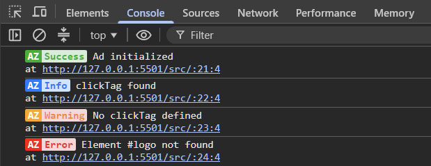
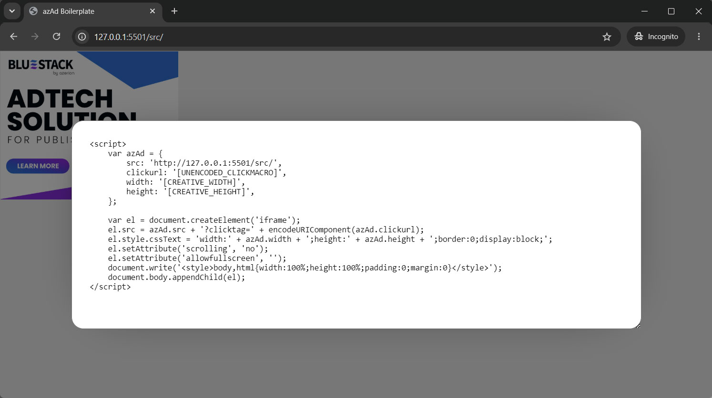
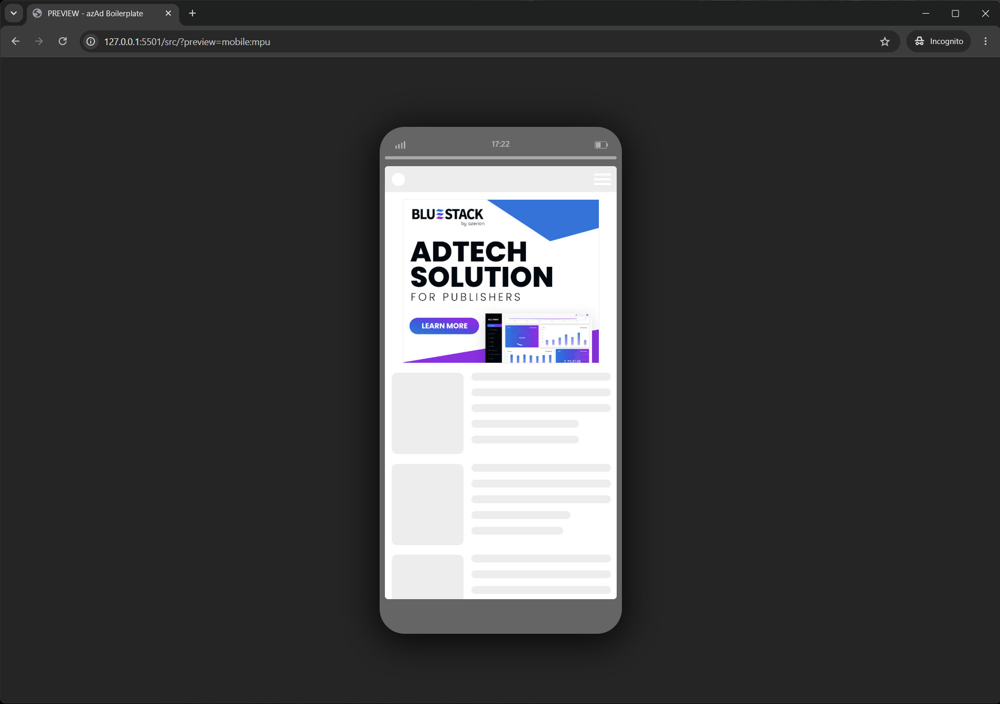
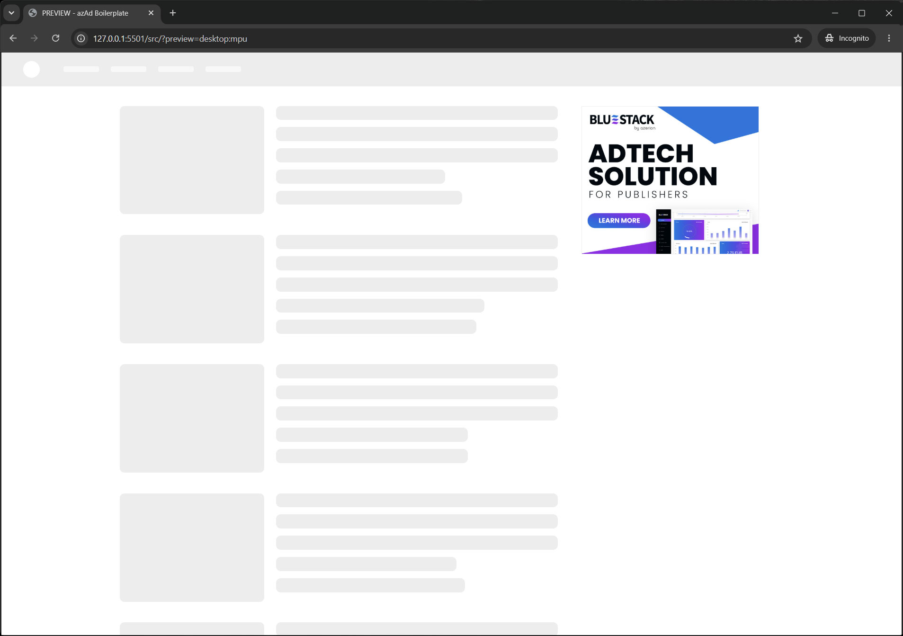

# azAd Boilerplate

A lightweight boilerplate for building HTML display ads. Handles clickout functionality, event tracking, ad tag generation, and a built-in preview mode — with no dependencies.

---

## Project Structure

```
src/
  index.html        # Ad entry point
  azAd.js           # Core ad toolkit
  style.scss        # Ad styles (source)
  style.css         # Compiled CSS
  style.min.css     # Minified CSS

tools/
  preview-mode/
    azPreview.js    # Preview mode script (loaded on demand)
    azPreview.css   # Preview mode styles
    azPreview.scss  # Preview mode styles (source)
```

---

## Table of Contents

- [Quick Start](#quick-start)
- [Features](#features)
  - [Clickout](#clickout-azadjs)
  - [Tracking Pixels](#tracking-pixels)
  - [DOM Helper — create()](#dom-helper--create)
  - [Logging — azLog()](#logging--azlog)
  - [Ad Tag Generator](#ad-tag-generator)
- [Preview Mode](#preview-mode)
  - [Phone Preview](#phone-preview-default)
  - [Desktop Preview](#desktop-preview)
  - [Supported Named Sizes](#supported-named-sizes)
  - [Custom Dimensions](#custom-dimensions)
- [Build](#build)
- [Releasing / CDN](#releasing--cdn)

---

## Quick Start

> [!TIP]
> Copy the `dist/` folder from this repository and start editing straight away — no install or build step required.


1. Build your ad inside `src/index.html`
2. Add your styles to `src/style.scss` / `style.min.css`
3. Configure the clickout at the top of the inline `<script>` in `index.html`:

```html
<script src="./azAd.min.js"></script>
<script>
    let clickTag = 'https://example.com';        // optional hardcoded fallback
    const clickElementIds = ['logo', 'cta-btn']; // elements that trigger clickout
                                                  // leave empty [] for full-body click
</script>
```

---

## Features

### Clickout (`azAd.js`)

Clickout URL is resolved in this order:

1. **URL parameter** `?clicktag=[ENCODED_CLICKURL]` — set by the ad server at serve time *(takes priority)*
2. **Hardcoded** `let clickTag = '...'` — fallback for development/testing

Define which elements should be clickable via `clickElementIds`. If the array is empty or undefined, the entire body becomes clickable.

---

### Engagement Tracking (with Pixels)

Fire a tracking pixel from anywhere in the ad:

```js
track('https://tracker.example.com/pixel?t=[timestamp]', 'eventName');
```

The `[timestamp]` placeholder is automatically replaced with `Date.now()` as a cachebuster.

---

### DOM Helper — `create()`

Convenience function for creating DOM elements:

```js
const el = create('div', {
    id: 'my-element',
    class: 'animated',
    style: 'opacity:0',
    content: '',
});
document.getElementById('azAd').appendChild(el);
```

---

### Logging — `azLog()`

Styled console output to make ad logs easy to spot in a busy console environment:

```js
azLog({ success: 'Ad initialized' });
azLog({ info: 'clickTag found' });
azLog({ warning: 'No clickTag defined' });
azLog({ error: 'Element #logo not found' });
```


<br>
Each log also shows the file and line number of the caller.

---

### Ad Tag Generator

<br><br>
Upload the ad to a CDN server and press **F10** on your keyboard while viewing the ad to generate a ready-to-use third-party ad tag. The overlay shows a read-only code block you can copy directly into your ad server.


The generated tag:
- Loads the ad in an iframe
- Accepts `?clicktag=[UNENCODED_CLICKMACRO]` — replace the placeholder with your ad server's unencoded click macro (the tag handles encoding internally)
- Replace `[CREATIVE_WIDTH]` and `[CREATIVE_HEIGHT]` with the actual dimensions

Close the overlay with **Esc** or the Close button.

---

## Preview Mode

Append `?preview=<size>` to the ad URL to open a device preview.
Two preview modes for mobile and desktop are possible.

  

### Phone preview (default)

```
index.html?preview=mrec
index.html?preview=phone:mrec
```

### Desktop preview
```
index.html?preview=desktop:mrec
index.html?preview=desktop:superbanner
```

### Supported named sizes

| Name | Width | Height | Notes |
|------|-------|--------|-------|
| `mrec` / `mpu` | 300px | 250px | |
| `hpa` | 300px | 600px | Half Page Ad |
| `banner` | 320px | 50px | Mobile banner |
| `superbanner` | 728px | 90px | Desktop leaderboard |
| `skyscraper` | 160px | 600px | |
| `billboard` | 970px | 250px | |
| `int` | full | full | Interstitial |

### Custom dimensions
```
index.html?preview=500x400
index.html?preview=desktop:970x250
```

Desktop previews wider than 340px are automatically placed above the article content instead of in the sidebar.

On a real mobile device (screen ≤ 480px), the phone frame is skipped and the dummy website renders as a normal page.

---

## Build

```bash
npm install        # install dependencies (first time only)
npm run build      # compile SCSS → CSS + minify JS + generate dist/
npm run build:css  # compile SCSS only
npm run build:js   # minify JS only
npm run build:dist # copy production-ready files to dist/
npm run watch      # auto-recompile ad styles on save
```

`npm run build` generates a `dist/` folder with only the files needed to start a new ad:

```
dist/
  index.html      # Ad entry point
  azAd.min.js     # Core toolkit (minified)
  style.scss      # Ad styles (source, editable)
  style.min.css   # Ad styles (compiled)
```

Copy `dist/` to start a new ad — no source files or build artifacts included.


---

## Releasing / CDN

The preview mode files are served via [jsDelivr](https://www.jsdelivr.com/) from this GitHub repository. Before releasing:

1. For new releases update version in `package.json`
2. During the build process all version numbers are updated automatically `AZ_VERSION` in `src/azAd.js` and uncomment the CDN lines:
```js
const AZ_VERSION = '2.0.1';
window.AZ_PREVIEW_CSS = `https://cdn.jsdelivr.net/gh/behring5/azad-boilerplate@${AZ_VERSION}/tools/preview-mode/azPreview.min.css`;
const previewSrc = `https://cdn.jsdelivr.net/gh/behring5/azad-boilerplate@${AZ_VERSION}/tools/preview-mode/azPreview.min.js`;
```
3. Commit all changes
4. Create a git tag (e.g. `v2.0.1`) via GitHub Desktop or GitHub.com → Releases
5. Push to GitHub

The CDN URL is then permanently available at that tag and will never change.
